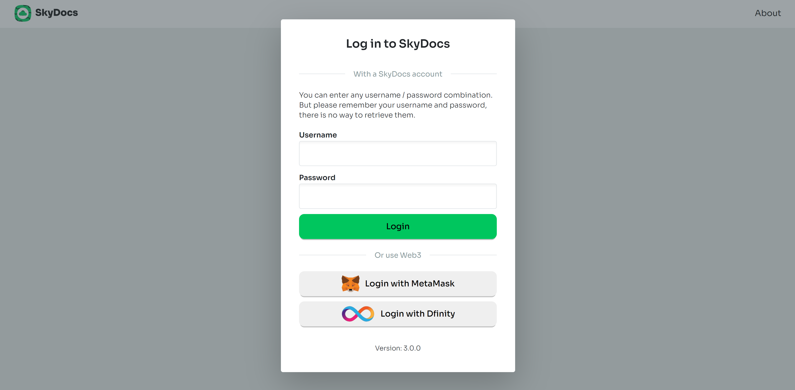
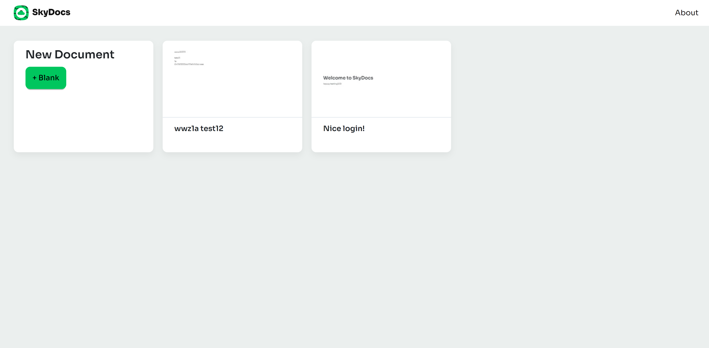
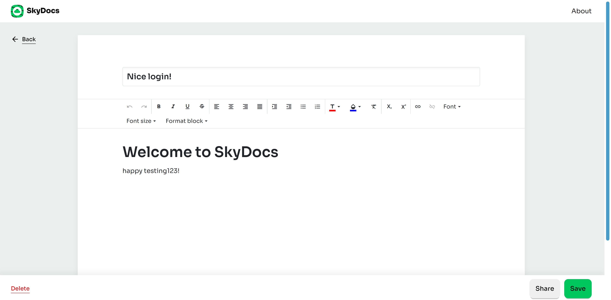
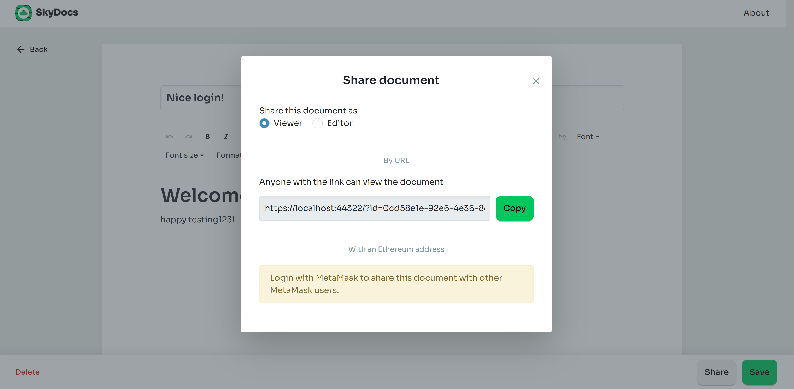

# SkyDocs

A decentralized Google Docs alternative running on Sia Skynet and Dfinity Internet Computer.

**Live version**: https://skydocs.hns.siasky.net   
Internet Computer: https://c3qag-6yaaa-aaaah-aaqta-cai.raw.ic0.app

Features:
- Login with your personal username and password
- See a list of your documents
- Screenshot preview of all documents
- Edit documents
- Delete documents
- Data is encrypted (except preview images)
- Share documents with other Ethereum users using The Graph

SkyDocs is build with Blazor and runs on WebAssembly. The [SiaSkynet C# SDK](https://github.com/michielpost/SiaSkynet) is used to communicate with Skynet and SkyDB.
The [Dfinity.Blazor C# SDK](https://github.com/michielpost/Dfinity.Blazor) is used to login and communicate with the Dfinity Internet Computer

Try the app hosted on Sia Skynet: https://skydocs.hns.siasky.net

---
## Instal for local development
- Install Visual Studio Code https://code.visualstudio.com/
- Install .Net 6 SDK https://dotnet.microsoft.com/download/dotnet/6.0
- Compile and run the project

## Share documents
It's possible to share documents by url, or using a smartcontract interaction when logged in with MetaMask.
This setup is explained [here](ShareArchitecture).

## Open Source Project Credits
- [SiaSkynet C# SDK](https://github.com/michielpost/SiaSkynet)
- [MetaMask.Blazor](https://github.com/michielpost/MetaMask.Blazor)
- [Dfinity.Blazor C# SDK](https://github.com/michielpost/Dfinity.Blazor)
- [Radzen.Blazor UI Components](https://github.com/radzenhq/radzen-blazor)
- [Blazored.LocalStorage](https://github.com/blazored/LocalStorage)

## Acknowledgements
Development of SkyDocs v2 has been made possible with a grant from [The Graph](https://thegraph.com/blog/wave-one-funding).

Development of SkyDocs v3 has been made possible with a grant from [Dfinity](https://medium.com/dfinity/dfinity-developer-grant-program-awards-102-grants-worth-2-04m-b49005d181cfg).

## Screenshots
Login

View all your documents

Edit a document

Share a document

## SkyDB Debut Hackathon
SkyDocs was created for *[The SkyDB Debut](https://gitcoin.co/hackathon/skydb/)* hackathon. 
Finished as Runner Up in the SkyDB Debut Hackathon: https://blog.sia.tech/skydb-debut-hackathon-winners-d7929970cdea  

[More info and screenshots can be found here.](SkyDocsV1.md)   
[Screenshots of V2 can be found here.](SkyDocsV2.md)
