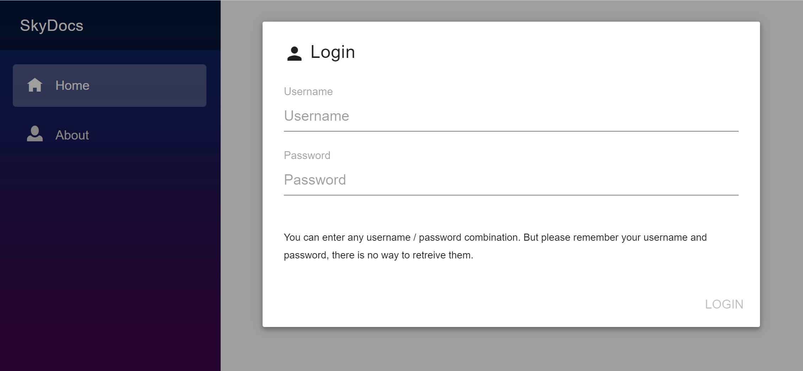
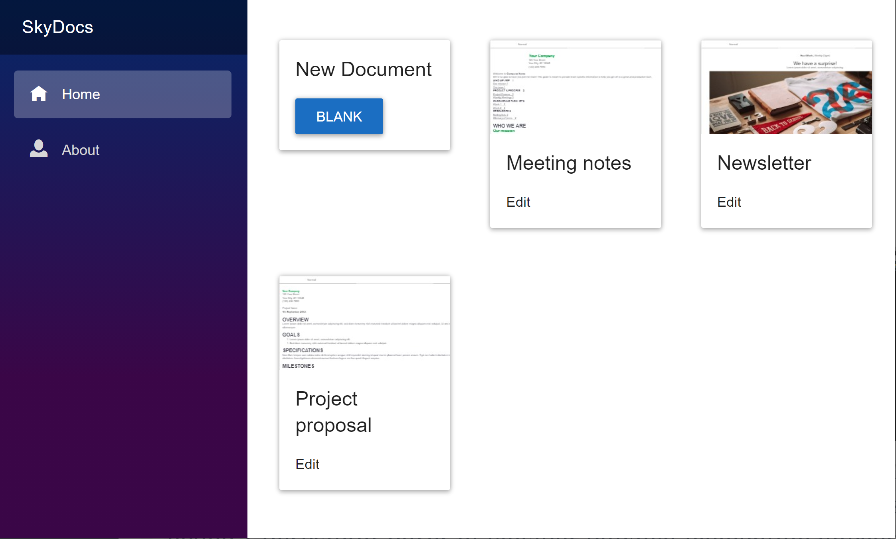
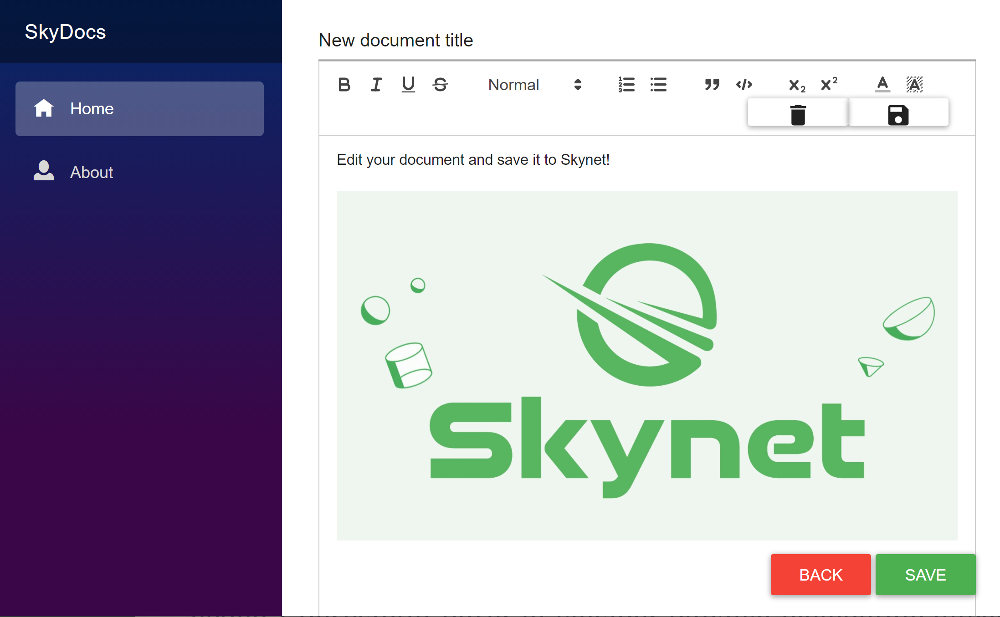

# SkyDocs
A Sia Skynet Google Docs alternative.

SkyDocs was created for *[The SkyDB Debut](https://gitcoin.co/hackathon/skydb/)* hackathon. 

Features:
- Login with your personal username and password
- See a list of your documents
- Screenshot preview of all documents
- Edit documents
- Delete documents

NOTE: All data is publicly stored on Sia Skynet. Encryption of your documents is not yet implemented.

SkyDocs is build with Blazor and runs on WebAssembly. The [SiaSkynet C# SDK](https://github.com/michielpost/SiaSkynet) is used to communicate with Skynet and SkyDB.

Demo video: https://siasky.net/AADh9ZruJIm-UqRKWNCA_uCh1sYYg4NvrWZUKKw3UbwXiw

Try the app hosted on Sia Skynet (first load can be slow, after that it's fast): https://siasky.net/RAB-QAQ9Ws8849yZiyhirgqsFycYAkj1MLOs0lc8nLJQfw

---

## Screenshots

Login

View all your documents

Edit a document

## Instal for local development
- Install Visual Studio Code https://code.visualstudio.com/
- Install .Net 5 SDK https://dotnet.microsoft.com/download/dotnet/5.0
- Compile and run the project

## Open Source Project Credits
- [SiaSkynet C# SDK](https://github.com/michielpost/SiaSkynet)
- [Blazorise](https://github.com/stsrki/Blazorise)

