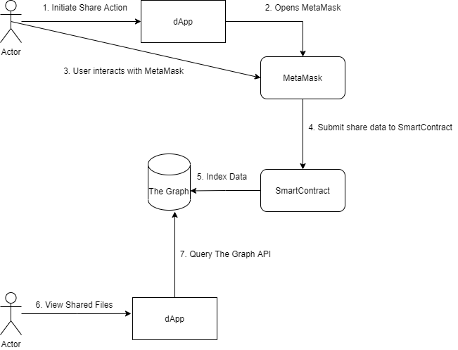

# Sharing Documents using The Graph

How does document sharing in SkyDocs work?

All users must be logged in using MetaMask, because we use a smartcontract transaction on the Ethereum network.

1) Initiate Share Action
When editing a document, there is a Share button. You can create a readonly or editable share link, or share data with another ethereum address.
When we want to share this document with another ethereum address, we input this and click Share.

This first triggers an internal step. A small json file with information on how to access the document is stored on SkyNet. This data is encrypted.
This results in an uri like `sia://skynet-link...`

2. dApp opens metaMask
The dApps triggers the browser to open MetaMask and has a prefilled transaction ready for the user. 

4. Submit share data to SmartContract
The transaction is a smartcontract interaction with [TheShareItNetwork(https://github.com/michielpost/TheShareItNetwork).

Data shared is:
- receiver: `0x...` ethereum address you want to share the document with
- appId: `SkyDocs`
- data: `siaL//skynet-link-to-encrypted-shae-info`

5. Index Data
The Graph indexes all interactions with this smartcontract in a [subgraph](https://thegraph.com/explorer/subgraph/michielpost/the-shareit-network) and makes it available using a GraphQL AP

6.  View shared files
The user requests to view all files shared with in the dApp

7. Query The Graph API
This triggers the dApp to user The Graph API to request documents shared with this user.
The user can then open the shared file and add it to it's document collection.

[TheGraph.Client](https://github.com/michielpost/TheGraph.Client) is used to query The Graph API from the dApp.